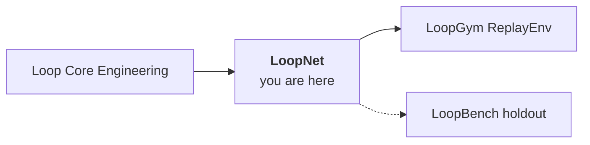

<div align="center">

# LoopNet

**Ground truth for self-improving systems.**

Structured loop designs, execution trajectories, outcomes, and failure modes — so you can train, evaluate, and debug loops with data, not anecdotes.

<br>

[](https://github.com/KanakMalpani/loopnet/actions/workflows/validate.yml)
[](LICENSE)
[](DATACARD.md)
[](data/seed/records.jsonl)
[](DATACARD.md)
[](https://huggingface.co/datasets/KanakMalpani/loopnet-seed-v0.1)

<br>

[**Load the dataset**](#load-in-one-minute) · [**Data card**](DATACARD.md) · [**Schema**](schema/loopnet-record-v1.json) · [**Labeling guide**](guides/LABELING-GUIDE.md)

</div>

---

## Why this exists

Computer vision had ImageNet. RL had MuJoCo. **Loop engineering had no shared corpus.**

LoopNet fills that gap: every record is a complete loop story — spec, trajectory, outcome, LES breakdown, and when things break, a **`fail.*` code** from the [shared taxonomy](https://github.com/KanakMalpani/Loop-Core-Engineering/blob/main/specs/failure-taxonomy.md).

---

## What you can do with it

| Use case | How LoopNet helps |
|----------|-------------------|
| **Failure prediction** | 42% labeled failures — models learn what breaking looks like |
| **Benchmark generalization** | Same schema as [LoopBench](https://github.com/KanakMalpani/LoopBench) holdout (v0.2) |
| **Zero-cost replay** | Feed [LoopGym](https://github.com/KanakMalpani/LoopGym) ReplayEnv — no API spend |
| **Research & fine-tuning** | JSONL + Parquet + Hugging Face — train on loop structure, not chat logs |
| **Community contributions** | [`ln/record-v1`](schema/loopnet-record-v1.json) schema + validation gate |

---

## Corpus at a glance (seed v0.1)

| | |
|---|---|
| **Records** | 500 (400 train / 50 val / 50 test) |
| **Failure rate** | 42% — deliberate, so success-only bias doesn't dominate |
| **Schema** | `ln/record-v1` · pins `lss@1.0.0` + `les@1.0.0` |
| **Source** | Synthetic v0.1 with known ground truth |
| **License** | Code MIT · Dataset [CC BY 4.0](DATACARD.md) |

---

## Load in one minute

**Hugging Face** (recommended):

```python
from datasets import load_dataset

ds = load_dataset("KanakMalpani/loopnet-seed-v0.1", split="train")
print(ds[0]["outcome"], ds[0]["pattern_slug"])
```

**Stream from GitHub** (no clone):

```python
ds = load_dataset(
    "json",
    data_files="https://raw.githubusercontent.com/KanakMalpani/loopnet/main/data/seed/records.jsonl",
    split="train",
)
```

**Replay in LoopGym:**

```python
import loopgym as lg

env = lg.make("replay/loopnet-v1")
obs = env.reset(record_id="ln-00042")  # trajectory from corpus
```

---

## Where it sits



| Layer | Repo |
|-------|------|
| Specs & failure codes | [Loop Core Engineering](https://github.com/KanakMalpani/Loop-Core-Engineering) |
| **Dataset** | **LoopNet** |
| Execution | [LoopGym](https://github.com/KanakMalpani/LoopGym) |
| Public scores | [LoopBench](https://github.com/KanakMalpani/LoopBench) |

---

## Repository map

| Path | Purpose |
|------|---------|
| [`schema/loopnet-record-v1.json`](schema/loopnet-record-v1.json) | Canonical record schema |
| [`data/seed/records.jsonl`](data/seed/records.jsonl) | Seed corpus |
| [`scripts/validate_record.py`](scripts/validate_record.py) | Schema + policy validation |
| [`scripts/generate_seed.py`](scripts/generate_seed.py) | Deterministic regeneration (`--seed 42`) |
| [`DATACARD.md`](DATACARD.md) | Full documentation |

---

## Citation

```bibtex
@dataset{loopnet_seed_v01,
  title={LoopNet Seed Corpus v0.1},
  author={Malpani, Kanak},
  year={2026},
  url={https://huggingface.co/datasets/KanakMalpani/loopnet-seed-v0.1}
}
```

<div align="center">

<sub><a href="CONTRIBUTING.md">Contributing</a> · <a href="SECURITY.md">Security</a> · <a href="STATUS.md">Status</a></sub>

</div>
