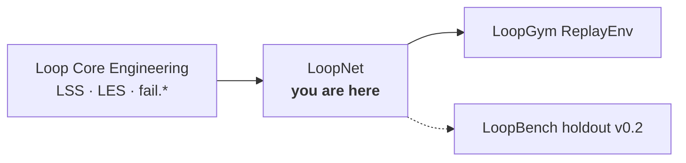

<p align="center">
  <strong>LoopNet</strong><br>
  <em>The ImageNet of Loop Engineering.</em>
</p>

<p align="center">
  <a href="https://github.com/KanakMalpani/loopnet/actions/workflows/validate.yml"></a>
  <a href="LICENSE"></a>
  <a href="DATACARD.md"></a>
  
  
  <a href="schema/loopnet-record-v1.json"></a>
</p>

---

**LoopNet** is a structured corpus of loop designs, execution trajectories, outcomes, and failure modes — built so researchers and engineers can train, evaluate, and debug **self-improving systems** with real ground truth, not anecdotes.

Each record conforms to **`ln/record-v1`**, pins **`lss@1.0.0`** / **`les@1.0.0`**, and ships with train/val/test splits. v0.1 is a **500-record synthetic seed** with a deliberate **42% failure rate** so models learn what breaking looks like, not just success stories.

<p align="center">
  <a href="#-load-in-3-lines"><strong>Load the data →</strong></a> ·
  <a href="DATACARD.md">Data card</a> ·
  <a href="PUBLISHING.md">Publish to Hugging Face</a>
</p>

---

## Why LoopNet matters

Computer vision had ImageNet. Reinforcement learning had Atari and MuJoCo. **Loop engineering had nothing** — until now.

| Question LoopNet answers | How |
|--------------------------|-----|
| What does a failed loop look like? | Labeled trajectories + `fail.*` codes |
| Can we predict failure before burn? | Features + outcome labels per record |
| Do benchmarks generalize? | Shared schema with [LoopBench](https://github.com/KanakMalpani/LoopBench) |
| Can we replay without API cost? | [LoopGym](https://github.com/KanakMalpani/LoopGym) ReplayEnv integration |

---

## Where it sits



| Repository | Role |
|------------|------|
| [Loop Core Engineering](https://github.com/KanakMalpani/Loop-Core-Engineering) | Spec pins & failure taxonomy |
| **LoopNet** | Dataset layer |
| [LoopGym](https://github.com/KanakMalpani/LoopGym) | Replays `records.jsonl` |
| [LoopBench](https://github.com/KanakMalpani/LoopBench) | Downstream evaluation |

---

## ⚡ Load in 3 lines

**No clone required** — stream from GitHub:

```python
from datasets import load_dataset

ds = load_dataset(
    "json",
    data_files="https://raw.githubusercontent.com/KanakMalpani/loopnet/main/data/seed/records.jsonl",
    split="train",
)
print(ds[0]["outcome"], ds[0]["pattern_slug"])
```

**Local clone:**

```bash
git clone https://github.com/KanakMalpani/loopnet.git && cd loopnet
pip install -r requirements.txt
python scripts/validate_record.py --require-count 500
```

**After [Hugging Face publish](PUBLISHING.md):**

```python
ds = load_dataset("KanakMalpani/loopnet-seed-v0.1", split="train")
```

---

## Corpus snapshot (seed v0.1)

| Metric | Value |
|--------|-------|
| Records | **500** |
| Train / val / test | 400 / 50 / 50 |
| Failure rate | **42.0%** (210 failures) |
| Source | 100% synthetic (known ground truth) |
| Schema | `ln/record-v1` |

Regenerate deterministically:

```bash
python scripts/generate_seed.py --count 500 --seed 42
python scripts/validate_record.py --require-count 500
```

---

## Repository layout

| Path | Purpose |
|------|---------|
| [`schema/loopnet-record-v1.json`](schema/loopnet-record-v1.json) | Canonical record schema |
| [`data/seed/records.jsonl`](data/seed/records.jsonl) | Seed corpus |
| [`data/seed/splits.json`](data/seed/splits.json) | Split manifest |
| [`scripts/validate_record.py`](scripts/validate_record.py) | Schema + policy gate |
| [`scripts/upload_hf.py`](scripts/upload_hf.py) | Parquet export + Hub upload |
| [`DATACARD.md`](DATACARD.md) | Full dataset documentation |
| [`guides/LABELING-GUIDE.md`](guides/LABELING-GUIDE.md) | Labeling for v1.0 community data |

---

## License

| Component | License |
|-----------|---------|
| Code (scripts, schema, builders) | [MIT](LICENSE) |
| Dataset (`data/seed/`) | [CC BY 4.0](DATACARD.md) |

---

## Citation

```bibtex
@dataset{loopnet_seed_v01,
  title={LoopNet Seed Corpus v0.1},
  author={Malpani, Kanak},
  year={2026},
  url={https://github.com/KanakMalpani/loopnet}
}
```

---

<p align="center">
  <sub>Contributions welcome · <a href="CONTRIBUTING.md">Contributing</a> · <a href="SECURITY.md">Security</a> · <a href="STATUS.md">Status</a></sub>
</p>
